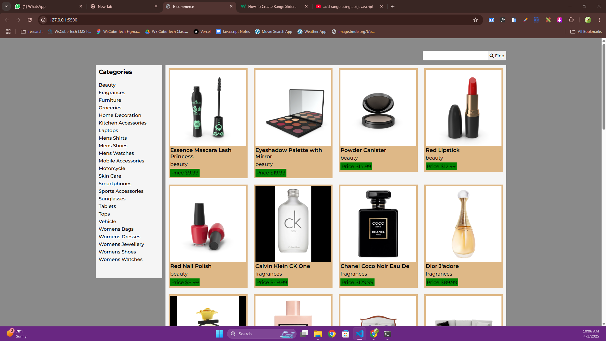

# E-commerce Website

This is a simple e-commerce website that allows users to browse product categories, search for products, and view product details. The website uses the [DummyJSON API](https://dummyjson.com/) to fetch product data.

## Features

- **Product Search:** Users can search for products using the search bar.
- **Category Browsing:** Products are displayed based on categories fetched from the API.
- **Responsive Design:** The layout adjusts to different screen sizes.
- **Dynamic Product Display:** Products are fetched and displayed dynamically using JavaScript.

## Technologies Used

- **HTML** - Structure of the website.
- **CSS & Responsive CSS** - Styling and layout, including responsiveness.
- **JavaScript** - Fetching data from the API and updating the UI dynamically.
- **DummyJSON API** - Provides sample product data.

## Screenshot



## File Structure

```
/ecommerce-project
│── index.html          # Main HTML file
│── style.css           # Main styles
│── responsive.css      # Responsive styles
│── script.js           # JavaScript functionality
│── images              # Screenshot of the website
│── README.md           # Project documentation
```

## Setup and Usage

1. Clone the repository or download the files.
2. Open `index.html` in a browser.
3. The search bar allows users to look up products.
4. Clicking on a category filters products dynamically.

## API Integration

The website fetches product data from the DummyJSON API:
- Categories: `https://dummyjson.com/products/categories`
- Search: `https://dummyjson.com/products/search?q=<query>`
- Products by category: `https://dummyjson.com/products/category/<category-name>`

## Future Improvements

- Add a shopping cart feature.
- Implement user authentication.
- Enhance UI with better styling and animations.

## Credits

Developed by **Virendra Sah**.
